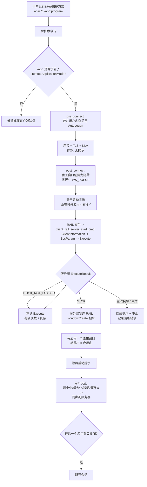

# Design Document — RemoteApp 无缝启动（Seamless Launch）

## Overview

本设计实现 RemoteApp 无缝启动体验：用户运行一个命令（或点击快捷方式），客户端在
后台静默完成身份验证，且只出现远程应用窗口 —— 绝不出现 Windows 登录界面、远程
桌面/外壳、"正在连接…/欢迎使用"提示或密码对话框。关闭应用窗口即断开会话。

本特性涉及两类职责：

1. **客户端行为（FreeRDP）。** 在 RemoteApp 模式下抑制所有桌面/登录界面，通过自动
   登录静默验证，可靠地驱动 RAIL 启动，并将连接生命周期绑定到应用窗口。这是主要
   范围，在 FreeRDP 客户端中实现。

2. **服务器前置条件（仅文档，非代码）。** 只有当 RDP 主机发布了该应用并加载了它的
   RemoteApp 外壳钩子时，RAIL 才能显示应用窗口。针对用户主机的实测证明这是一个
   硬性依赖：主机接受了连接并提供了完整桌面，但对每一次启动尝试都返回
   `RAIL_EXEC_E_HOOK_NOT_LOADED`。因此本设计纳入了服务器配置契约，并提供清晰的
   客户端诊断路径，使该情况被报告，而不是被无限静默重试。

### 验证状态（诚实声明）

- **Windows** 客户端（`wfreerdp.exe`）已编译，并针对用户服务器进行了实测运行。静默
  登录、桌面抑制、RAIL 握手、启动重试，以及 `rdpdr` 的乱序容忍，全部经过运行时验证。
- **X11** 客户端已有 splash + 桌面抑制的参考实现；Windows 的改动是对它的镜像。
  X11/Wayland/macOS 无法在当前构建机编译，因此它们的对齐改动是按参考实现编写，但
  未在此处编译验证。
- 最终"应用窗口被显示"的结果取决于服务器是否发布了应用。在正确配置的主机上，本设计
  产出无缝结果；在用户当前主机上，它正确地把 `HOOK_NOT_LOADED` 暴露为一个可诊断、
  在耗尽重试前不致命的状况。

## Architecture



### 桌面/登录抑制模型

在 RemoteApp 模式下，客户端主窗口永不作为可见表面 —— 它只是一个隐藏的宿主，承载
共享桌面位图，供每个应用的 RAIL 窗口从中拷贝。三层机制确保"绝不显示桌面/登录"：

1. **窗口创建层。** 宿主窗口被创建为隐藏、无边框、零尺寸（Windows：`WS_POPUP` +
   `WS_EX_TOOLWINDOW`，跳过 `UpdateWindow`；X11：`override_redirect`，绝不作为桌面
   映射）。
2. **绘制层。** 首次绘制的"显示窗口"信号以 `!RemoteApplicationMode` 为条件门控
   （Windows：抑制 `WM_FREERDP_SHOWWINDOW`；X11：`xf_OutputUpdate` 跳过桌面表面），
   即使服务器在应用窗口出现前推送桌面/锁屏输出，也不会被呈现。
3. **反馈层。** 启动提示给出即时反馈并保持置顶，使其后面的内容（瞬时的桌面/锁屏帧）
   不被泄露，随后被真实应用窗口替换。

## Components and Interfaces

### C1. 命令行入口 / 启动契约

- 输入：`/v:<host:port> /u:<user> /p:<pass>（或 /from-stdin） /app:program:"<path>" /cert:ignore`。
- `/app:program:` 已设置 `FreeRDP_RemoteApplicationMode` 及相关标志
  （`cmdline.c: parse_app_option_program`）。无需新增 CLI 接口。
- 生成的快捷方式/启动器（`run-example.cmd` 风格）封装该命令，并设置
  `OPENSSL_MODULES`，使 NTLM/NLA 能配合捆绑的 legacy provider 工作。

### C2. 静默身份验证（自动登录）

- 位置：各客户端的 `pre_connect`（Windows：`wf_pre_connect`）。
- 规则：WHEN 设置了 `RemoteApplicationMode` AND 存在用户名，置
  `FreeRDP_AutoLogonEnabled = TRUE`，使服务器无界面登录。
- 凭据回调在凭据存在时已短路，`/from-stdin` 会委托给通用 CLI 处理器 —— 因此不会
  出现 GUI 密码对话框。密码绝不写入日志或可见表面。

### C3. 宿主窗口抑制

- 位置：各客户端的 `post_connect` + 绘制路径。
- Windows：`wf_post_connect` 把 `wfc->hwnd` 创建为 `WS_POPUP` / `WS_EX_TOOLWINDOW`，
  跳过 `UpdateWindow`；`wf_end_paint` 在 `RemoteApplicationMode` 下跳过
  `WM_FREERDP_SHOWWINDOW`。
- X11（参考）：`xf_create_window` / `xf_OutputUpdate` 已在 `remote_app` 模式下跳过
  桌面表面。

### C4. 启动反馈提示

- X11 参考：`xf_splash.{c,h}` —— 无边框居中窗口，显示"正在打开应用 <名称>"，置顶，
  在首个 RAIL 窗口出现时替换，并有超时安全网兜底。
- Windows/Wayland/macOS：等效的轻量反馈作为对齐工作描述；提示契约（显示 → 置顶 →
  首个窗口出现时替换 → 超时）在各平台一致。

### C5. RAIL 启动驱动与可靠性

- 共享：`client_rail_server_start_cmd`（channels/rail/client）按规范顺序发送
  `ClientInformation` → `ClientSystemParam` → `ClientExecute`。
- 可靠性（Windows：`wf_rail_server_execute_result`）：收到
  `RAIL_EXEC_E_HOOK_NOT_LOADED` 时，重试 Execute，最多 `WF_RAIL_EXEC_MAX_RETRIES`
  （30）次，每次间隔 `WF_RAIL_EXEC_RETRY_DELAY_MS`（1000ms），而不是首次瞬时失败
  就中止。成功时重置重试计数。
- 终止：当重试耗尽（服务器确实没有 RemoteApp 钩子）时，隐藏启动提示并以清晰、可
  操作的日志信息中止，而不是无限循环。

### C6. rdpdr 顺序容忍

- 位置：`channels/rdpdr/client/rdpdr_main.c`，`PAKID_CORE_USER_LOGGEDON`。
- 某些主机在能力交换完成前发送 `USER_LOGGEDON`。将这一乱序 PDU 视为非致命（警告 +
  继续），而不是返回 `ERROR_INTERNAL_ERROR`（先前这会在启动中途拆掉整个连接）。
  设备列表声明推迟到能力到达后进行。

### C7. 每应用窗口生命周期

- RAIL `WindowCreate` 指令为每个远程窗口创建一个原生顶层窗口，标题为应用名
  （Windows：`wf_rail_window_common`）。
- 本地最小化/最大化/移动/调整大小/关闭通过 RAIL 客户端 PDU（activate、window-move、
  syscommand、sysmenu）同步到服务器。
- WHEN 最后一个 RAIL 窗口被删除（`wf_rail_window_delete` → `HashTable_Count == 0`），
  调用 `freerdp_abort_connect_context` 断开连接。

### C8. 服务器前置条件（配置契约，文档化）

- 应用窗口要出现，主机必须在输入桌面上运行 RemoteApp 外壳钩子。这要求以下之一：
  - 安装了 RDSH 角色并发布了应用的 Windows Server，或
  - 启用了 `TSAppAllowList` 并添加了应用条目的桌面版 Windows
    （`fDisabledAllowList=1`，`Applications\<id>\{Name,Path}`）。
- 诊断契约：成功的桌面连接（不带 `/app`）与每次 `/app` 尝试都返回 `HOOK_NOT_LOADED`
  同时出现，表明主机不提供 RemoteApp；这被记录为解决路径，而非客户端缺陷。

## Data Models

```c
/* Windows 客户端上下文新增（client/Windows/wf_client.h） */
struct wf_context {
    /* ... 已有字段 ... */
    RailClientContext* rail;
    wHashTable*        railWindows;     /* windowId -> wfRailWindow */
    wHashTable*        railNotifyIcons;
    UINT32             railExecRetries;  /* HOOK_NOT_LOADED 重试计数 */
    /* ... */
};

/* 可靠性调参（client/Windows/wf_rail.c） */
#define WF_RAIL_EXEC_MAX_RETRIES     30
#define WF_RAIL_EXEC_RETRY_DELAY_MS  1000

/* X11 启动提示（client/X11/xf_splash.h）—— 参考反馈模型 */
struct xf_splash {
    Window handle; GC gc; XFontSet fontSet;
    int width, height; unsigned long bg, fg, accent;
    char* message; UINT64 startTime; /* 超时安全网 */
};
```

无缝启动流程的状态（每连接）：

- `AutoLogonEnabled`：在 pre_connect 中由 RemoteApp + 用户名推导。
- `is_shown`（宿主窗口）：在 RemoteApp 模式下绝不置为"显示/映射"。
- `railExecRetries`：0..MAX；在 `RAIL_EXEC_S_OK` 时重置。
- splash 活动：从进入 RemoteApp 到首个 RAIL 窗口或超时为 TRUE。

## Error Handling

| 状况 | 行为 |
|---|---|
| 缺少凭据，非交互式 | 快速失败并给出清晰错误；无阻塞提示 |
| TLS/NLA 进行中 | 除启动提示外无系统装饰 |
| 服务器在应用窗口前推送桌面/锁屏 | 由绘制层门控抑制；提示保持置顶 |
| `RAIL_EXEC_E_HOOK_NOT_LOADED`（瞬时） | 重试 Execute，最多 MAX 次带间隔 |
| `RAIL_EXEC_E_HOOK_NOT_LOADED`（耗尽） | 隐藏提示、中止、记录可操作信息（服务器缺少 RemoteApp 钩子） |
| 其他 `RAIL_EXEC_E_*`（文件未找到、不在白名单、拒绝访问） | 隐藏提示、中止、记录具体错误码 |
| `rdpdr` 乱序 `USER_LOGGEDON` | 非致命警告 + 继续（C6） |
| 最后一个应用窗口关闭 | 干净断开（C7） |
| 连接断开 | 拆除提示 + RAIL 窗口，且不暴露桌面 |
| 提示超时（无应用窗口） | 关闭提示，避免用户卡住 |

## Correctness Properties

以下是实现必须满足的可执行规范。它们均为客户端侧，可在构建机上测试。

### Property 1: 无桌面泄露
在 RemoteApp 模式下，首个 RAIL 窗口存在之前的每一帧，宿主桌面窗口都绝不被映射/显示。

**Validates: Requirements 2.1, 2.2, 2.3, 3.5**

### Property 2: 静默身份验证
在提供完整凭据并处于 RemoteApp 模式时，绝不显示交互式凭据提示，且 `AutoLogonEnabled`
为 TRUE。

**Validates: Requirements 1.1, 1.2, 1.4**

### Property 3: 启动可靠性
有限次 `HOOK_NOT_LOADED`（次数 < MAX）后跟一次 `S_OK`，结果是恰好一个运行中的应用、
零次中止；连续 MAX 次失败则结果是恰好一次干净中止。

**Validates: Requirements 3.3, 6.1**

### Property 4: 窗口生命周期
关闭最后一个 RAIL 窗口总是断开连接；关闭非最后窗口绝不断开连接。

**Validates: Requirements 4.3, 6.2**

### Property 5: rdpdr 顺序容忍
乱序的 `USER_LOGGEDON` PDU 绝不导致连接中止。

**Validates: Requirements 6.3**

端到端"应用窗口出现"的结果还额外要求一个启用了 RemoteApp 的服务器（C8）；它只在正确
配置的主机上被验证，且明确不在客户端控制范围内。

## Testing Strategy

### 测试层级

- **单元 / 逻辑：** 重试计数转移（P3）、最后窗口断开（P4）、rdpdr 状态容忍（P5）。
  现有的 `libfreerdp/common/test/TestRail.c` 是 RAIL 顺序单元覆盖的归属。
- **构建验证：** Windows 客户端编译通过（此处只能构建该客户端）。
- **实测场景：** 文档化的两步诊断 —— (a) 不带 `/app` 连接，确认主机提供桌面；
  (b) 带 `/app` 连接，观察 RAIL 启动 —— 用于区分客户端行为与服务器配置。本工作期间
  已针对用户主机验证。

### 诚实说明

属性 P1–P5 均为客户端侧，可在此处测试。端到端"应用窗口出现"的结果还额外要求一个
启用了 RemoteApp 的服务器（C8）；它只在正确配置的主机上被验证，且明确不在客户端
控制范围内。
