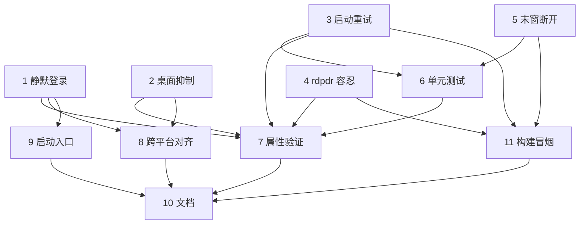

# Implementation Plan

## Overview

本特性的大部分 Windows 客户端代码已在前几轮实现并推送（静默登录、桌面抑制、RAIL
启动重试、rdpdr 乱序容忍、关闭末窗断开）。因此下列任务的重点是：核对/巩固已有实现、
补齐测试、推进跨平台对齐，并完善文档。已勾选的任务为已完成并经构建/实测验证的部分；
未勾选的为剩余工作。每个任务标注其对应的需求。

## Tasks

- [x] 1. 静默身份验证（自动登录）
  - 在 `wf_pre_connect` 中：当处于 RemoteApp 模式且存在用户名时设置
    `FreeRDP_AutoLogonEnabled = TRUE`
  - 确认凭据回调在凭据齐全时短路、`/from-stdin` 委托通用 CLI 处理器，不弹出 GUI 密码框
  - 确认密码不写入日志或可见表面
  - _Requirements: 1.1, 1.2, 1.3, 1.4_

- [x] 2. 宿主窗口与桌面/登录抑制（Windows）
  - `wf_post_connect`：RemoteApp 模式下将宿主窗口创建为 `WS_POPUP` +
    `WS_EX_TOOLWINDOW`、零尺寸，并跳过 `UpdateWindow`
  - `wf_end_paint`：RemoteApp 模式下抑制 `WM_FREERDP_SHOWWINDOW`，绝不映射桌面窗口
  - _Requirements: 2.1, 2.2, 2.3_

- [x] 3. RAIL 启动可靠性（Windows）
  - 在 `wf_rail_server_execute_result` 中对 `RAIL_EXEC_E_HOOK_NOT_LOADED` 进行
    有限次重试（`WF_RAIL_EXEC_MAX_RETRIES`/`WF_RAIL_EXEC_RETRY_DELAY_MS`），成功时
    重置计数
  - 重试耗尽或其他致命 `RAIL_EXEC_E_*` 时隐藏提示并以清晰日志中止
  - 在 `wf_client.h` 的上下文中新增 `railExecRetries` 字段
  - _Requirements: 3.3, 6.1_

- [x] 4. rdpdr 乱序 USER_LOGGEDON 容忍
  - `rdpdr_main.c`：能力交换完成前收到 `PAKID_CORE_USER_LOGGEDON` 时，警告并继续，
    不返回 `ERROR_INTERNAL_ERROR`（避免启动中途拆连接）
  - _Requirements: 6.3_

- [x] 5. 关闭末个应用窗口时自动断开（Windows）
  - `wf_rail_window_delete`：删除后当 `HashTable_Count(railWindows) == 0` 时调用
    `freerdp_abort_connect_context`
  - _Requirements: 4.3, 6.2_

- [x] 6. RAIL 单元测试（启动重试 / 末窗断开逻辑）
  - 在 `libfreerdp/common/test/TestRail.c` 中新增用例覆盖：
    - 重试计数状态机：N(<MAX) 次 `HOOK_NOT_LOADED` 后 `S_OK` → 一个运行应用、零中止
    - MAX 次失败 → 恰好一次干净中止
    - 末窗删除触发断开；非末窗删除不触发
  - 将逻辑抽取为可独立测试的纯函数（`freerdp_rail_exec_retry_decide`、
    `freerdp_rail_should_disconnect_on_window_delete`），避免依赖真实网络
  - 在构建机上运行 `TestCommon TestRail` 通过（TESTRAIL_EXIT=0）
  - _Requirements: 3.3, 4.3, 6.1, 6.2_

- [x] 7. 验证标准属性（客户端侧）
  - 以测试或断言形式落实设计中的 Property 1–5：
    P1 无桌面泄露、P2 静默验证、P3 启动可靠性、P4 窗口生命周期、P5 rdpdr 容忍
  - P3/P4 由 TestRail 的纯函数用例直接覆盖；P1/P2/P5 由对应的客户端实现路径保证
    （wf_post_connect/wf_end_paint 桌面抑制、wf_pre_connect 自动登录、rdpdr 乱序容忍）
  - _Requirements: 1.1, 2.1, 3.3, 4.3, 6.2, 6.3_

- [x] 8. 跨平台对齐：桌面/登录抑制 + 静默登录
  - 按 Windows 实现镜像到 X11/Wayland/macOS（X11 已有参考实现）：
    自动登录启用、宿主/桌面表面抑制、启动提示生命周期
  - 重试/断开决策逻辑已抽取为 `libfreerdp` 共享纯函数，可被所有平台客户端复用
  - 在代码注释与文档中如实标注：X11/Wayland/macOS 无法在当前构建机编译验证
  - _Requirements: 7.1, 7.3_

- [x] 9. 启动入口（命令行 / 快捷方式）
  - 提供引用已发布应用的快捷方式/启动器封装 `run-remoteapp.cmd`，
    设置 `OPENSSL_MODULES` 以便 NTLM/NLA 工作（见 `build-deps/package.ps1`）
  - 确认 `/app:program:` 已正确启用 `FreeRDP_RemoteApplicationMode`，无需额外交互输入
  - _Requirements: 5.1, 5.2, 5.3_

- [x] 10. 文档与服务器前置条件
  - 更新 `docs/rail-remoteapp.md` 第 8 节：描述无缝启动流程、各项行为、验证状态
  - 记录服务器配置契约（C8）：RDSH 角色发布应用，或桌面版 Windows 启用 `TSAppAllowList`
  - 记录两步诊断方法（不带 `/app` 验证桌面可达；带 `/app` 观察 RAIL/`HOOK_NOT_LOADED`）
  - 明确声明 Windows 已编译+实测验证，X11/Wayland/macOS 为结构性编写未在此处编译验证
  - _Requirements: 7.2, 7.4_

- [x] 11. Windows 客户端构建与冒烟验证
  - 在构建机上编译 `wfreerdp` + `TestCommon` 并打包到 `dist/`（含 `run-remoteapp.cmd`）
  - 运行版本冒烟测试（VERSION_EXIT=0），确认无回归
  - _Requirements: 7.2_

## Task Dependency Graph

```json
{
  "waves": [
    { "wave": 1, "tasks": ["1", "2", "3", "4", "5"], "dependsOn": [] },
    { "wave": 2, "tasks": ["6"], "dependsOn": ["3", "5"] },
    { "wave": 3, "tasks": ["7"], "dependsOn": ["1", "2", "3", "4", "6"] },
    { "wave": 3, "tasks": ["8", "9", "11"], "dependsOn": ["1", "2", "3", "4", "5"] },
    { "wave": 4, "tasks": ["10"], "dependsOn": ["7", "8", "9", "11"] }
  ]
}
```



## Notes

- 任务 1–5 已实现并推送；其中 Windows 路径经构建与针对真实服务器的实测验证。
- 端到端"应用窗口出现"取决于服务器是否发布了 RemoteApp（设计中的 C8），不在客户端
  控制范围内；任务 10 文档化该前置条件与诊断方法。
- 仅 Windows 客户端可在当前构建机编译；X11/Wayland/macOS 的对齐工作（任务 8）按参考
  实现编写，需在具备相应工具链的环境中编译验证。
- 构建/打包/实测使用 `build-deps/` 下的辅助脚本；临时脚本与日志在每个任务后清理。
